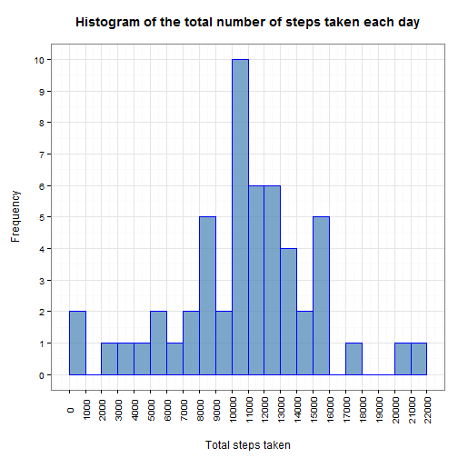
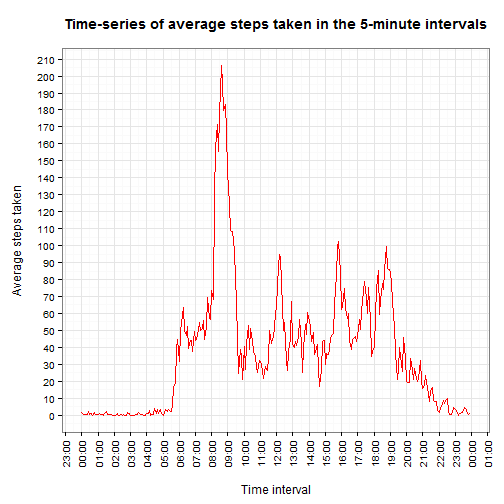
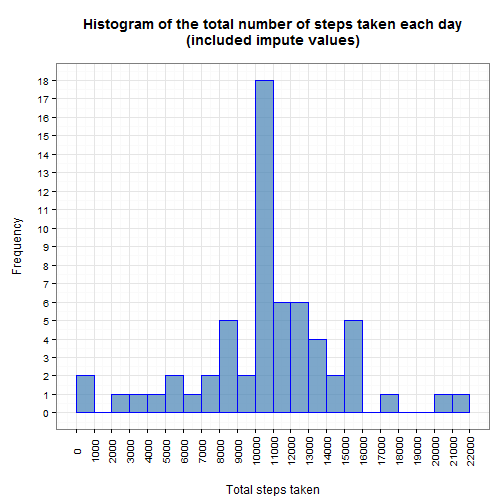
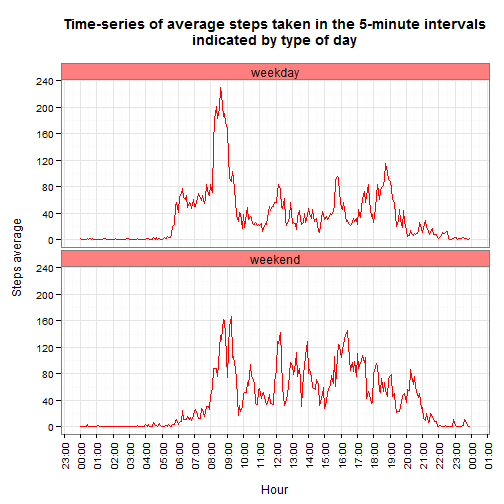

Reproducible Research Course Project 1
======================================
--------------------------------------

This html document is an example of Literate Programming by using R programming language and RMarkdown
dynamic document.

The main goal of the project is making use of the data from a personal activity monitoring device. This
device collects data at 5 minutes intervals through out the day. The dataset consists of two months of data
from an anonymous person and include the number of steps taken in 5 minute interval each day.

The GitHub repository: ```https://github.com/LUKSUS/RepData_PeerAssessment1```, contains the required data in
file ```activity.zip```, but alternatively we can download it directly to working directory in R:

```r
# download.file('https://d396qusza40orc.cloudfront.net/repdata%2Fdata%2Factivity.zip', 'acitivity.zip')
```

### Loading and preprocessing the data:

First thing is to unzip the file:

```r
unzip('activity.zip')
```

Then it is possible to load the data into R:

```r
data <- read.csv('activity.csv', header = TRUE, sep = ',', stringsAsFactors = FALSE)
```

### What is mean total number of steps taken per day:

Prepare input data to make a plot, aggregate data by daily total number of steps:

```r
data1 <- with(data, aggregate(list(steps = steps), list(date = date), FUN = sum))
```

Load ggplot2 library and make a histogram of the total number of steps taken each day:

```r
library(ggplot2)

ggplot(data1, aes(steps)) +
    geom_bar(stat = 'bin', colour = 'blue', fill = 'steelblue', alpha = 0.7, binwidth = 1000) +
    theme_bw() +
    theme(axis.text.x = element_text(angle = 90, vjust = 0.5)) +
    theme(plot.title = element_text(face='bold')) +
    scale_x_continuous(breaks = seq(0, 22000, 1000), limits = c(0, 22000)) +
    scale_y_continuous(breaks = seq(0, 100, 1)) +
    labs(title = 'Histogram of the total number of steps taken each day\n') +
    labs(x = '\nTotal steps taken') +
    labs(y = 'Frequency\n')
```

 

The mean of total number of steps taken per day:

```r
format(mean(data1$steps, na.rm = TRUE), nsmall = 2)
```

```
## [1] "10766.19"
```

The median of total number of steps taken per day:

```r
format(median(data1$steps, na.rm = TRUE), nsmall = 2)
```

```
## [1] "10765"
```

### Average daily activity pattern:

Prepare input data to make a plot, aggregate data by average number of steps in each interval:

```r
data2 <- with(data, aggregate(list(steps = steps), list(interval = interval), mean, na.rm = TRUE))
data2$time <- as.POSIXct(strptime(sprintf("%04d", data2$interval), "%H%M"), format="%H:%M")
```

Make a time series plot of the average number of steps, across all days, taken in each 5-minute interval:

```r
library(scales)

ggplot(data2, aes(time, steps)) +
    geom_line(colour = 'red') +
    theme_bw() +
    theme(axis.text.x = element_text(angle = 90, vjust = 0.5)) +
    theme(plot.title = element_text(face='bold')) +
    scale_x_datetime(breaks = '1 hour', labels = date_format("%H:%M")) +
    scale_y_continuous(breaks = seq(0, 300, 10)) +
    labs(title = 'Time-series of average steps taken in the 5-minute intervals\n') +
    labs(x = '\nTime interval') +
    labs(y = 'Average steps taken\n')
```

 

Show the 5-minute interval which, on average across all the days, contains the maximum number of steps:

```r
data2$interval[which.max(x = data2$steps)]
```

```
## [1] 835
```

### Imputing missing values:

Calculate and report the total number of missing values in the dataset:

```r
sum(is.na(data$steps))
```

```
## [1] 2304
```

All of the missing values in ```data$steps``` will be filling in by mean value of steps taken in each
5-minute interval, then the result will be stored in new object called ```data.new```:

```r
# aggregate data by average steps taken in each interval interval
data3 <- with(data, aggregate(list(avSteps = steps), list(interval = interval), mean, na.rm = TRUE))

# round average values to 0 digits
data3$avSteps <- round(data3$avSteps, 0)

# merge original dataset with aggregate dataset by interval variable
data3 <- merge(data, data3, by = 'interval')
data3 <- data3[order(data3$date), ]
rownames(data3) <- NULL

# impute missing values
for (i in 1:nrow(data3)) { if (is.na(data3$steps[i])) { data3$steps[i] <- data3$avSteps[i] } }

# create new dataset
data.new <- data3[, c('steps', 'date', 'interval')]
```

Prepare input data to make a plot, aggregate data by daily total number of steps:

```r
data3 <- with(data.new, aggregate(list(steps = steps), list(date = date), sum))
```

Make a histogram of the total number of steps taken each day, based on data frame with imputed values:

```r
ggplot(data3, aes(steps)) +
    geom_bar(stat = 'bin', colour = 'blue', fill = 'steelblue', alpha = 0.7, binwidth = 1000) +
    theme_bw() +
    theme(axis.text.x = element_text(angle = 90, vjust = 0.5)) +
    theme(plot.title = element_text(face='bold')) +
    scale_x_continuous(breaks = seq(0, 22000, 1000), limits = c(0, 22000)) +
    scale_y_continuous(breaks = seq(0, 100, 1)) +
    labs(title = 'Histogram of the total number of steps taken each day\n(included impute values)\n') +
    labs(x = '\nTotal steps taken') +
    labs(y = 'Frequency\n')
```

 

The new value of mean for new dataset is:

```r
format(mean(data3$steps), nsmall = 2)
```

```
## [1] "10765.64"
```

The new value of median for new dataset is:

```r
format(median(data3$steps), nsmall = 2)
```

```
## [1] "10762.00"
```

We can observe that the mean and median values in new dataset are lower compared to original dataset:

```r
matrix <- matrix(c(mean(data1$steps, na.rm = T), mean(data3$steps),
                   mean(data1$steps, na.rm = TRUE) - mean(data3$steps),
                   median(data1$steps, na.rm = TRUE), median(data3$steps),
                   median(data1$steps, na.rm = TRUE) - median(data3$steps)), 2, 3, byrow = TRUE,
                 dimnames = list(c('Mean:', 'Median:'), c('Original data:', 'Imputed data:', 'Difference:')))
table <- as.table(matrix)
table
```

```
##         Original data: Imputed data: Difference:
## Mean:        1.077e+04     1.077e+04   5.493e-01
## Median:      1.076e+04     1.076e+04   3.000e+00
```

After imputing missing data we can observe more observations with values in the middle of interval (hour)
axis. The rest number of values seems to stay in the same level as before imputing.

### Differences in activity patterns between weekdays and weekends:

First step here is to change language by using ```Sys.setlocale``` function:

```r
Sys.setlocale('LC_TIME', 'English')
```

```
## [1] "English_United States.1252"
```

Create a new factor variable in the dataset with two levels: ```weekday``` and ```weekend```, indicating
whether a given day is a weekday or weekend day:

```r
data.new$date <- as.Date(data.new$date, '%Y-%m-%d')
data.new$type <- ifelse(test = weekdays(data.new$date) == 'Saturday' | weekdays(data.new$date) == 'Sunday',
                        yes = 'weekend', no = 'weekday')
data.new$type <- as.factor(data.new$type)
```

Prepare input data to make a plot, aggregate data by average number of steps in each interval and day type:

```r
data4 <- with(data.new, aggregate(list(steps = steps), list(type = type, interval = interval), mean))
data4$interval <- as.POSIXct(strptime(sprintf("%04d", data4$interval), "%H%M"), format="%H:%M")
```

Make a panel plot containing a time series of the 5-minute interval and the average number of steps taken,
averaged across all weekday days or weekend days:

```r
ggplot(data4, aes(interval, steps)) +
    facet_wrap(~ type, nrow = 2, ncol = 1) +
    geom_line(colour = 'red') +
    theme_bw() +
    theme(axis.text.x = element_text(angle = 90, vjust = 0.5)) +
    theme(strip.text.x = element_text(size = 12)) +
    theme(strip.background = element_rect(fill = rgb(1, 0, 0, 0.5))) +
    theme(plot.title = element_text(face='bold')) +
    scale_x_datetime(breaks = '1 hour', labels = date_format("%H:%M")) +
    scale_y_continuous(breaks = seq(0, 300, 40)) +
    labs(title = 'Time-series of average steps taken in the 5-minute intervals\nindicated by type of day\n') +
    labs(x = '\nHour') +
    labs(y = 'Steps average\n')
```

 
